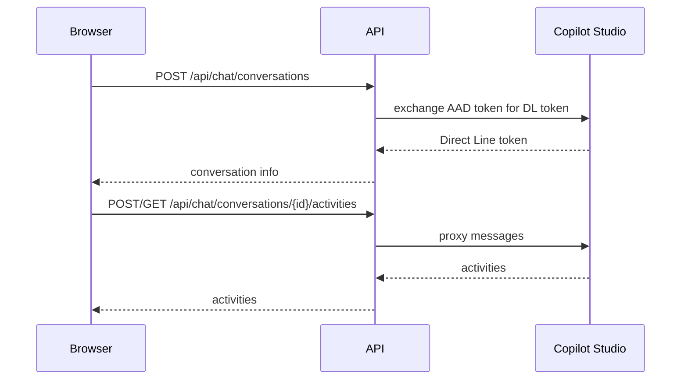

# Copilot Studio Chat

Minimal custom chat application for Copilot Studio.

## Sequence Diagram


## Local Development

Set the following environment variables:

```
TENANT_ID=
CLIENT_ID=
AGENT_ID=
ENVIRONMENT_ID=
RESOURCE_APP_ID=
TOKEN_ENDPOINT=
DIRECTLINE_ENDPOINT=https://directline.botframework.com
KEY_VAULT_URI=
CLIENT_SECRET_NAME=CLIENT-SECRET
```

Install dependencies and run:

```bash
pip install fastapi uvicorn requests python-dotenv azure-identity azure-keyvault-secrets
uvicorn backend.main:app --reload
```

## Deployment

```bash
az deployment sub create \
  --location <region> \
  --template-file infra/main.bicep \
  --parameters prefix=<app> environment=prod
```
