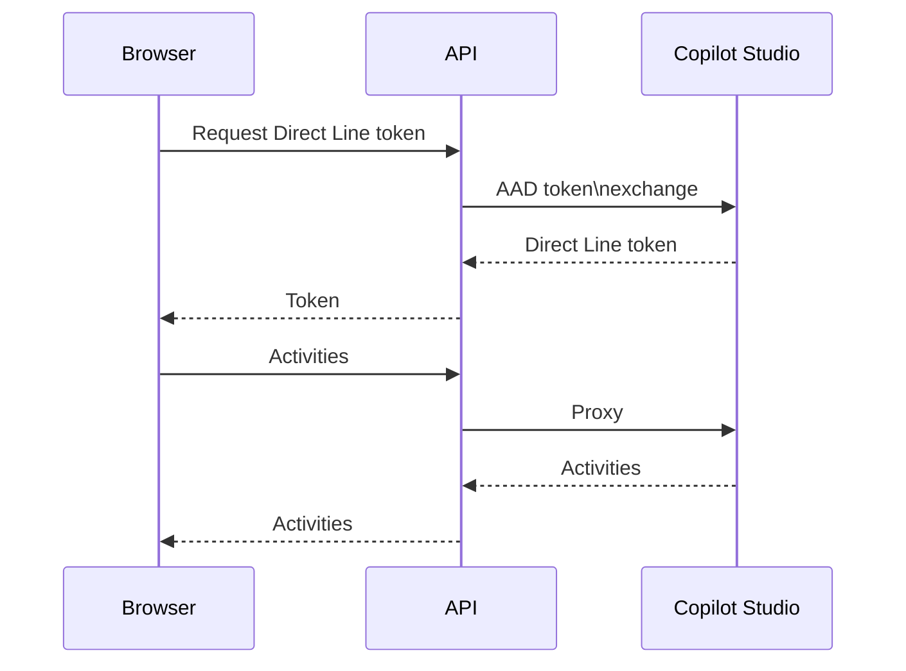

# Copilot Chat Sample

Minimal web app for chatting with a Copilot Studio agent.

## Setup

```bash
az deployment sub create \
  --location eastus \
  --template-file infra/main.bicep \
  --parameters appName=mycopilot
```

Create a `.env` file with your tenant and agent info.
Run the API locally with `uvicorn backend.main:app --port 8000`.

## Diagram

